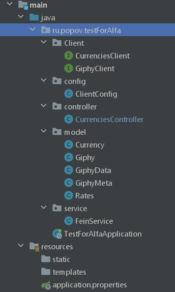
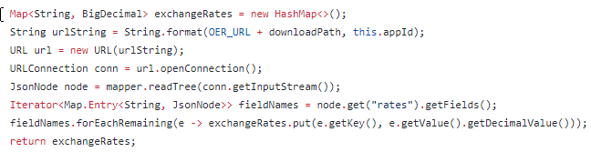

Данный проект - тестовое задание для Альфа банка.

В проекте использовались следующие библиотеки:
1. spring-boot-starter-web
2. spring-cloud-starter-openfeign
3. org.projectlombok:lombok

Небольшой disclaimer!

**Сервис openexchangerates не дает выбрать валюту по умолчанию "RUB", для этого надо сменить тариф
на платный, поэтому я использовал валюту по умолчанию установленную сервисом openexchangerate, это 
USD.**

Так как это тестовое задание, то следует написать, что я точно не сделал, а надо бы.
1. Различные проверки на null и пустые строки.
2. Проверки валидности входящей валюты.
3. Обработка ответов сторонних сервисов, отличных от 200.
4. Боле глубоки рефактор кода. Вынос в отдельные методы, абстракция и т.д.
5. Более детальное написание тестов.
6. Настройка конфигурации.
7. Код короткий и простой, поэтому я пренебрег написание комментариев к коду.

Структура проекта:

**Краткое описание сервиса:**

Основная логика развернута в классах CurrenciesController, CurrenciesClient, GiphyClient, FeinService.

На endpoint CurrenciesController (http://такой-то адрес/{money})поступает наименование валюты.
 Смотрим на openexchangerates.org/api/ какой курс был сегодня и вчера для этой валюты по отношению к доллару
посредством Fein-client, логика которого реализована в интерфейсе CurrenciesClient через сервис FeinService.
Fein-client возвращает нам ответ в виде класса Currency и вложенного класса Rates, преобразованного из JSON.
Для того, чтобы не использовать рефлексию я преобразую Currency обратно в JSON и достаю оттуда все значения rates в
HashMap<String, Double> (API openexchangerates может возвращать нам множество кусов валют). Первое, что пришло в голову,
наверняка можно по другому.
 Сравниваем курсы за вчера и сегодня и если курс вырос, то через интерфейс GiphyClient получаем случайный gif с тегом 
"rich". Для преобразования ответа от сервиса Giphy используем одноименный класс Giphy. Если курс упал, получаем 
случайный gif с тегом "broke".
 Результат Giphy, содержащий url gif и другие данные, возвращаем в ответе нашего endpoint.

Конечно такую простую логику проще было реализовать через несколько строчек:

Для запуска проекта в docker необходимо запустить сборку проекта(bootJar, build), и 
запустить файл docker-compose.yaml